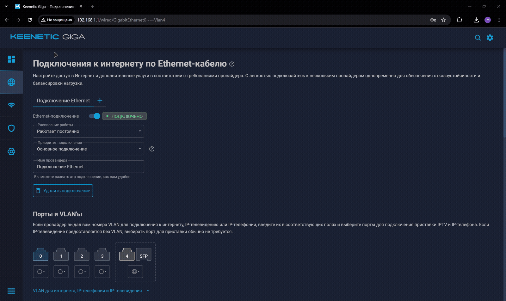
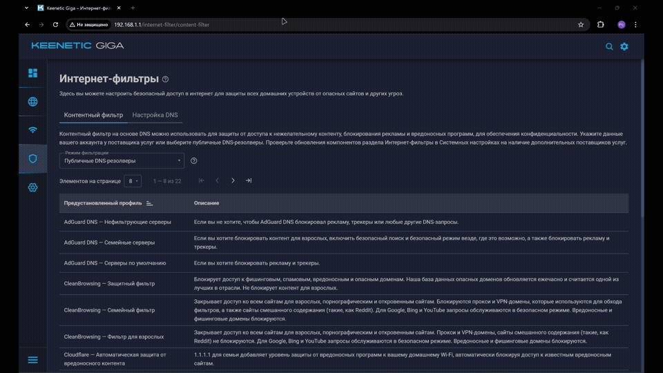

# Установка и настройка VLESS на Keenetic


## Поддерживаемое оборудование 

| Модель     | CPU       | RAM    | USB           | VPN (WireGuard)           | VLESS (реально) |
| ---------- | --------- | ------ | ------------- | ------------------------- | --------------- |
| **Hopper** | 2×900 MHz | 256 MB | USB 3.0       | ~130 Mbps ([Keenetic][1]) | 80–120 Mbps     |
| **Giga**   | 2×1.3 GHz | 512 MB | USB 3.0       | ~400–500 Mbps             | 250–400 Mbps    |
| **Hero**   | 2×1.3 GHz | 512 MB | USB 3.0 + 2.0 | ~460 Mbps ([Keenetic][1]) | 350–500 Mbps    |
| **Titan**  | 3×1.8 GHz | 1 GB   | USB 3.2 + 2.0 | ~900 Mbps ([Keenetic][1]) | 600–900 Mbps    |

1. Необходимо сбросить настройки wifi роутера до заводских настроек. 
2. Подгатавливаем флешку.


## Приоритеты подключений 

1. Перейдите в раздел Приоритеты подключений → Политики доступа в интернет
2. Создайте политику с именем `XKeen`

3. Выберите способ доступа к интернету — отметьте провайдера или нескольких

??? Warning "SWAP"
     Доступна «Многопутевая передача». Используйте её, если у вас два провайдера.

4. Перейдите в раздел Приоритеты подключений → Применение политик

5. Добавьте в созданную политику `XKeen` устройства



??? Info "Xkeen"
     Все клиенты или сеть, подключённые к политике XKeen, будут работать через прокси.

## Перенесем сервисы Keenetic с 443 порта на другой порт

??? note "CLI"
     - Переходим в CLI роутера, данную информацию вводим с троку браузера.
     ```bash linenums="1" 
     192.168.1.1/a
     ```
     - Задаём новый порт: 
     ```bash linenums="1" 
     ip http ssl port {port}  # (1)!
     ```

     1.  `{port}`: Здесь указываем новый порт, Например 5443, 8443 - С данного порта будет доступено удаленное управление KEENETIC 


     - Сохраняем параметры 
     ```bash linenums="1" 
     system configuration save
     ```

## Установка системы пакетов репозитория Entware на USB-накопитель


!!! note ""
     1. Необходимо любая флешка. Если будем использовать файл подкачки, то лучше использовать высокоростную. 
     2. Необходимо скачать и установить программу [MiniTool Partition Wizard Free Edition](https://www.partitionwizard.com/)
     3. Создать два раздела **swap** - подкачка и отдельный раздел отформатированный под EXT4, где будет распологаться XKeen.

??? Warning "SWAP"
     
     Ядро системы имеет ограничение на размер области SWAP. Обычно не требуется более чем в три раза превышать размер ОЗУ области. Если размер раздела превышает системное ограничение, в журнал будет выведено предупреждение об этом (например, такое: `Truncating oversized swap area, only using 2097152k out of 8388604k`) и использоватьс
     я в качестве SWAP будет лишь часть выделенного раздела. Справочная информация [KEENETIC](https://support.keenetic.ru/ultra/kn-1811/ru/20978-preparing-a-usb-drive-as-storage-and-activating-a-swap-partition.html)


После того, как отформатировали флешку в нужные разделы, его необходимо вставить в KEENETIC


## Установка необходимых компонентов KEENETIC

`Управление`  → `Параметры системы`   →  `Компоненты`

??? warning "Набор необходимых компонентов"
    - Интерфейс USB
    - Файловая система Ext
    - Общий доступ к файлам и принтерам по протоколу SMB
    - Поддержка открытых пакетов
    - Прокси-сервер DNS-over-TLS
    - Прокси-сервер DNS-over-HTTPS
    - Протокол IPv6
    - Модули ядра подсистемы Netfilter

??? warning "ВАЖНО !"
     Важно: После установки компонентов роутер может автоматически перезагрузиться. Дождитесь полной загрузки системы.

??? warning "СОВЕТ"
     Если какого-то компонента нет — обновите прошивку Keenetic до последней версии.



## Установка Entware (OPKG)

`Entware (OPKG)` — это менеджер пакетов Linux, необходимый для установки `Xray`, `VLESS` и скрипта `XKeen`. Для установки требуется USB-накопитель с файловой системой `EXT4`.

1. Убедитесь, что USB-накопитель подключён и отображается в веб-интерфейсе роутера.

В веб-интерфейсе Keenetic перейдите в `Приложения` → `Диски и принтеры`


??? warning "СОВЕТ"
     Если накопитель не отображается — убедитесь, что установлены компоненты `USB` и Файловая система `EXT4`.

2. Выбор архива Entware в зависимости от модели роутера


??? question "Entware"
     | Архитектура | Архив | Поддерживаемая модель |
     | --- | --- | --- | 
     | 🟢 **mipsel** | [mipsel-installer.tar.gz](https://bin.entware.net/mipselsf-k3.4/installer/mipsel-installer.tar.gz) | 4G (KN-1212) |
     | 🟢 **mipsel** | [mipsel-installer.tar.gz](https://bin.entware.net/mipselsf-k3.4/installer/mipsel-installer.tar.gz) | Omni (KN-1410) |
     | 🟢 **mipsel** | [mipsel-installer.tar.gz](https://bin.entware.net/mipselsf-k3.4/installer/mipsel-installer.tar.gz) | Extra (KN-1710) |
     | 🟢 **mipsel** | [mipsel-installer.tar.gz](https://bin.entware.net/mipselsf-k3.4/installer/mipsel-installer.tar.gz) | Extra (KN-1711) |
     | 🟢 **mipsel** | [mipsel-installer.tar.gz](https://bin.entware.net/mipselsf-k3.4/installer/mipsel-installer.tar.gz) | Extra (KN-1713) |
     | 🟢 **mipsel** | [mipsel-installer.tar.gz](https://bin.entware.net/mipselsf-k3.4/installer/mipsel-installer.tar.gz) | Giga (KN-1010) |
     | 🟢 **mipsel** | [mipsel-installer.tar.gz](https://bin.entware.net/mipselsf-k3.4/installer/mipsel-installer.tar.gz) | Giga (KN-1011) |
     | 🟢 **mipsel** | [mipsel-installer.tar.gz](https://bin.entware.net/mipselsf-k3.4/installer/mipsel-installer.tar.gz) | Ultra (KN-1810) |
     | 🟢 **mipsel** | [mipsel-installer.tar.gz](https://bin.entware.net/mipselsf-k3.4/installer/mipsel-installer.tar.gz) | Viva (KN-1910) |
     | 🟢 **mipsel** | [mipsel-installer.tar.gz](https://bin.entware.net/mipselsf-k3.4/installer/mipsel-installer.tar.gz) | Viva (KN-1912) |
     | 🟢 **mipsel** | [mipsel-installer.tar.gz](https://bin.entware.net/mipselsf-k3.4/installer/mipsel-installer.tar.gz) | Viva (KN-1913) |
     | 🟢 **mipsel** | [mipsel-installer.tar.gz](https://bin.entware.net/mipselsf-k3.4/installer/mipsel-installer.tar.gz) | Giant (KN-2610) |
     | 🟢 **mipsel** | [mipsel-installer.tar.gz](https://bin.entware.net/mipselsf-k3.4/installer/mipsel-installer.tar.gz) | Hero 4G (KN-2310) |
     | 🟢 **mipsel** | [mipsel-installer.tar.gz](https://bin.entware.net/mipselsf-k3.4/installer/mipsel-installer.tar.gz) | Hero 4G (KN-2311) |
     | 🟢 **mipsel** | [mipsel-installer.tar.gz](https://bin.entware.net/mipselsf-k3.4/installer/mipsel-installer.tar.gz) | Hopper (KN-3810) |
     | 🟢 **mipsel** | [mipsel-installer.tar.gz](https://bin.entware.net/mipselsf-k3.4/installer/mipsel-installer.tar.gz) | Zyxel Keenetic II / III |
     | 🟢 **mipsel** | [mipsel-installer.tar.gz](https://bin.entware.net/mipselsf-k3.4/installer/mipsel-installer.tar.gz) | Extra / Extra II |
     | 🟢 **mipsel** | [mipsel-installer.tar.gz](https://bin.entware.net/mipselsf-k3.4/installer/mipsel-installer.tar.gz) | Giga II / III |
     | 🟢 **mipsel** | [mipsel-installer.tar.gz](https://bin.entware.net/mipselsf-k3.4/installer/mipsel-installer.tar.gz) | Omni / Omni II |
     | 🟢 **mipsel** | [mipsel-installer.tar.gz](https://bin.entware.net/mipselsf-k3.4/installer/mipsel-installer.tar.gz) | Viva |
     | 🟢 **mipsel** | [mipsel-installer.tar.gz](https://bin.entware.net/mipselsf-k3.4/installer/mipsel-installer.tar.gz) | Ultra / Ultra II |
     | 🟡 **mips** | [mips-installer.tar.gz](https://bin.entware.net/mipssf-k3.4/installer/mips-installer.tar.gz) | Ultra SE (KN-2510) |
     | 🟡 **mips** | [mips-installer.tar.gz](https://bin.entware.net/mipssf-k3.4/installer/mips-installer.tar.gz) | Giga SE (KN-2410) |
     | 🟡 **mips** | [mips-installer.tar.gz](https://bin.entware.net/mipssf-k3.4/installer/mips-installer.tar.gz) | DSL (KN-2010) |
     | 🟡 **mips** | [mips-installer.tar.gz](https://bin.entware.net/mipssf-k3.4/installer/mips-installer.tar.gz) | Skipper DSL (KN-2112) |
     | 🟡 **mips** | [mips-installer.tar.gz](https://bin.entware.net/mipssf-k3.4/installer/mips-installer.tar.gz) | Duo (KN-2110) |
     | 🟡 **mips** | [mips-installer.tar.gz](https://bin.entware.net/mipssf-k3.4/installer/mips-installer.tar.gz) | Hopper DSL (KN-3610) |
     | 🟡 **mips** | [mips-installer.tar.gz](https://bin.entware.net/mipssf-k3.4/installer/mips-installer.tar.gz) | Zyxel Keenetic DSL / LTE / VOX |
     | 🔵 **aarch64** | [aarch64-installer.tar.gz](https://bin.entware.net/aarch64-k3.10/installer/aarch64-installer.tar.gz) | Peak (KN-2710) |
     | 🔵 **aarch64** | [aarch64-installer.tar.gz](https://bin.entware.net/aarch64-k3.10/installer/aarch64-installer.tar.gz) | Ultra (KN-1811) |
     | 🔵 **aarch64** | [aarch64-installer.tar.gz](https://bin.entware.net/aarch64-k3.10/installer/aarch64-installer.tar.gz) | Giga (KN-1012) |
     | 🔵 **aarch64** | [aarch64-installer.tar.gz](https://bin.entware.net/aarch64-k3.10/installer/aarch64-installer.tar.gz) | Hopper (KN-3811) |
     | 🔵 **aarch64** | [aarch64-installer.tar.gz](https://bin.entware.net/aarch64-k3.10/installer/aarch64-installer.tar.gz) | Hopper SE (KN-3812) |

3. В веб-интерфейсе роутера перейдите в `Приложения` → `Диски и принтеры`.

4. Выберите подключённый USB-накопитель и нажмите Создать папку.

5. Назовите папку `install` и поместите в неё ранее скачанный архив `Entware`.

6. Запуск установки Entware
    - В веб-интерфейсе Keenetic: `Приложения` → `OPKG`
    - Выберите USB-накопитель и в поле Init-скрипт укажите:

    
     ```bash linenums="1" 
          /opt/etc/init.d/rc.unslung
     ```
     - Нажмите Сохранить и дождитесь завершения установки
 


 
!!! success "Успешная установка"
     Успешная установка Entware отображается в системном журнале без ошибок. После этого можно переходить к подключению по SSH.

??? warning "ВАЖНО !!!"
     Важно! Если Entware не устанавливается — проверьте:
          - правильность выбранного архива
          - файловую систему EXT4
          - корректную работу USB-накопителя
 

## Подключение по SSH

Подключитесь к роутеру по SSH (Putty / MobaXterm):

IP: 192.168.1.1
Порт: 22 или 222
Логин: root
Пароль: keenetic
При вводе пароля символы не отображаются

Подключение, для того чтобы запустить cmd выполните слеующию комбинацию `win` + `r` 
     
следующей комбинацией подключаемся:

```bash linenums="1" 
ssh root@192.168.1.1 -p22
```

Пароль

```bash linenums="1" 
keenetic
```

Обновите пакеты Entware:

```bash linenums="1" 
opkg update && opkg upgrade
```


## Установка XKeen (Hysteria2 / Vless)

Скачайте и запустите установщик XKeen:

```bash linenums="1" 
opkg install curl tar unzip && curl -sOfL https://raw.githubusercontent.com/RockBlack-VPN/XKeen/main/install.sh && chmod +x ./install.sh && ./install.sh
```

??? warning "ВАЖНО! Если установка не запускается, води команды по отдельности. После эиого должно заработать."

```bash linenums="1" 
opkg install curl tar unzip
```
```bash linenums="1" 
curl -sOfL https://raw.githubusercontent.com/RockBlack-VPN/XKeen/main/install.sh
```

```bash linenums="1" 
chmod +x ./install.sh
```

```bash linenums="1" 
./install.sh
```
!!! success "Успешная установка"
     Успешная установка Entware отображается в системном журнале без ошибок. После этого можно переходить к подключению по SSH.

Во время установки, если есть необходимость включайте следующее:

- GeoIP
- GeoSite
- Автообновление
- Выберите ядро проксирования для загрузки и установки: `3. Xray + Mihomo` 


## Необходимо сгенерировать конфигурационный файл `config.yaml`

1. Переходим на генератор конфигурация  [config.yaml](https://generator.rockblack.pro/). После генерации конфигурации, скачиваем данный файл. 

2. Заходим в настройки Wifi роутера KEENETIC и переходим в `Управление` -> Приложение, переходим в файловую систему флешки и переходим к следующей папке `/etc/mihomo/` В папке `mihomo` заменяем файл `config.yaml`.


## Запуск Proxy

1. Переключаемся на ядро Mihomo 

```
xkeen -mihomo
```
2. Запускаем XKeen для работы с Hysteria2

```
xkeen -start
```

3. Проверяем статус запуска Xkeen
```
xkeen -status
```

## Подключение к панели Zashboard

Для мониторинга и управления необходимо использовать веб панель:
```
http://192.168.1.1:9090/ui/
```


## ОТкрытие сервисных портов 

📱 WhatsApp

``` bash 
xkeen -ap 80,443,3478,46420
```

💬 Telegram

``` bash 
xkeen -ap 80,443,596:599,1400,5222
```

📞 Viber

``` bash 
xkeen -ap 80,443,9443,2233,543
```

🎤 Discord

``` bash 
xkeen -ap 80,443,50000:50030
```


🎮 Throne and Liberty

``` bash 
xkeen -ap 80,443,10000,11005
```

🎮 Roblox

``` bash 
xkeen -ap 80,443,49152:65535
```

🎮 Xbox Cloud Gaming

``` bash 
xkeen -ap 80,443,3544
```

🎮 Supercell

``` bash 
xkeen -ap 80,443,9339
```

🟩 Minecraft Java

``` bash 
xkeen -ap 80,443,25565
```

Перезапуск

``` bash 
xkeen -restart
```